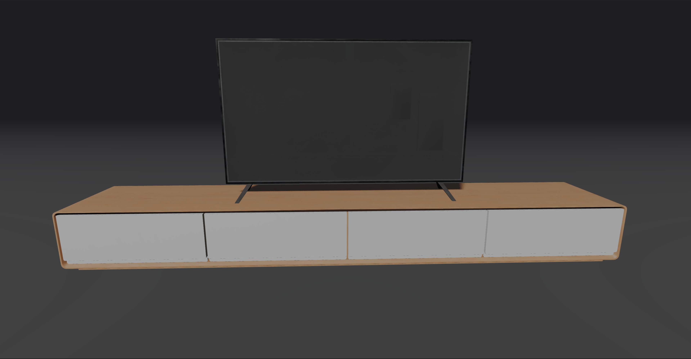

# 3D TV

> [!WARNING]
> This project is still in development and may not work as expected.

<div style="display: flex; flex-direction: column; justify-content: center;">
   <div style="display: flex; justify-content: center;">
      
   </div>
   </br>
   <div style="display: flex; flex-direction: row; justify-content: space-between;">
      
      
      
   </div>
</div>

### Built With

- [Blender](https://www.blender.org/)
- [R3F-Vite-Starter-Template](https://github.com/jeffrey-omega/R3F-Vite-Starter-Template)

### Installation

> [!TIP]
> if you don't use pnpm, you can replace `pnpm` with `npm` or `yarn` in the following commands.

1. Clone the repo

   ```sh
   git clone url
   ```

2. Navigate to the project directory

   ```sh
    cd project-directory
   ```

3. Install pnpm packages

   ```sh
    pnpm install
   ```

### Usage

1. Start the development server
   ```sh
    pnpm dev
   ```
2. Build the project
   ```sh
    pnpm build
   ```
